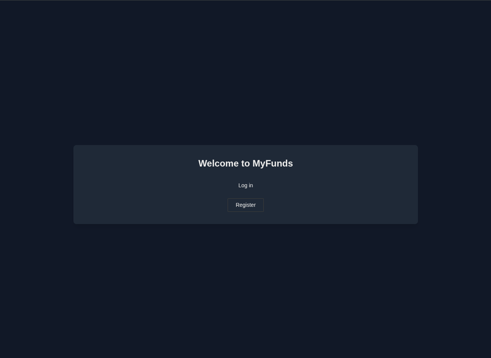
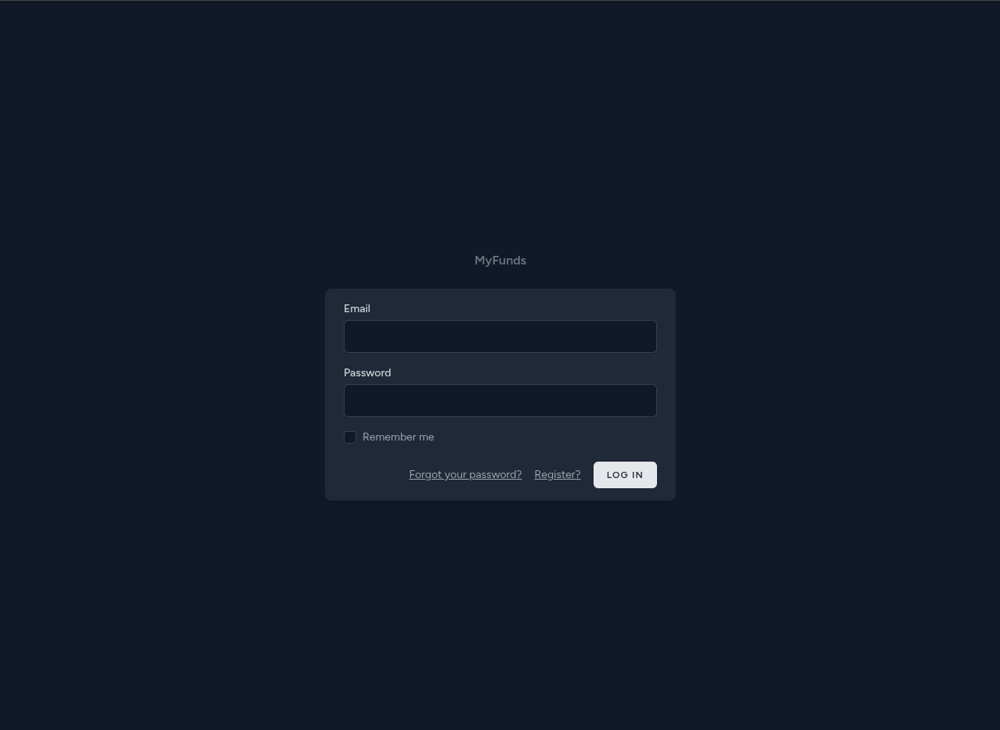
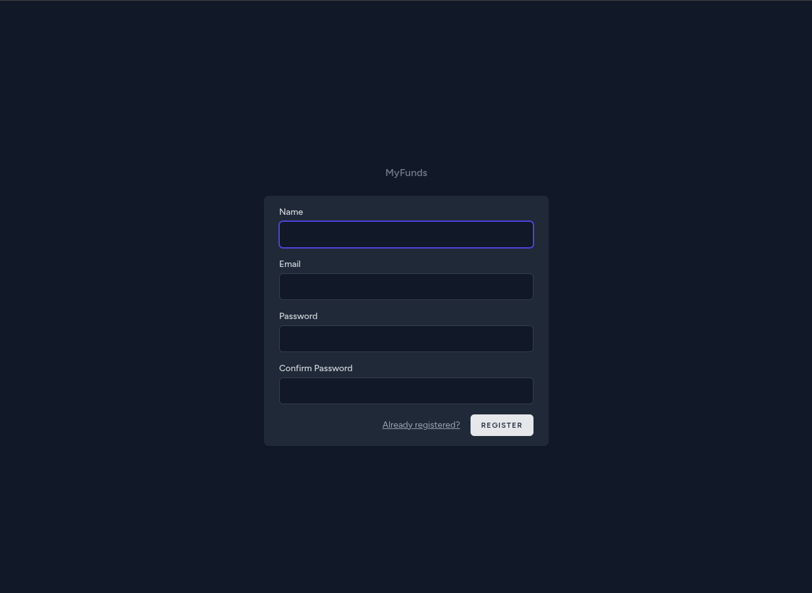
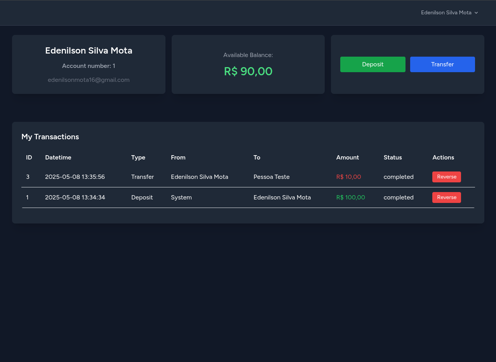
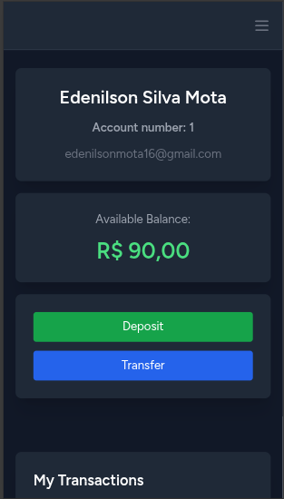

# 📄 MyFunds
Sistema feito para um teste técnico.  
MyFunds é uma API REST para controle de transações financeiras pessoais entre usuários, com funcionalidades como depósito, transferência e reversão de transações.

## 📚 Sumário

- [📄 MyFunds](#-myfunds)
  - [📚 Sumário](#-sumário)
  - [🛠️ Tecnologias utilizadas](#️-tecnologias-utilizadas)
  - [📸 Screenshots](#-screenshots)
    - [🏠 Página Inicial](#-página-inicial)
    - [🔐 Tela de Login](#-tela-de-login)
    - [📝 Tela de Cadastro](#-tela-de-cadastro)
    - [📊 Dashboard](#-dashboard)
    - [📱 Mobile](#-mobile)
  - [🚀 Subindo a aplicação](#-subindo-a-aplicação)
    - [Requisitos:](#requisitos)
    - [Criando o `.env` a partir do `.env.example` (Linux):](#criando-o-env-a-partir-do-envexample-linux)
    - [Credenciais do banco de dados:](#credenciais-do-banco-de-dados)
    - [Subir os containers:](#subir-os-containers)
    - [Instalar dependências, gerar app\_key e rodar as migrations:](#instalar-dependências-gerar-app_key-e-rodar-as-migrations)
  - [🔐 Autenticação](#-autenticação)
    - [Register](#register)
    - [Login](#login)
  - [💰 1. Depósito](#-1-depósito)
  - [🔁 2. Transferência entre usuários](#-2-transferência-entre-usuários)
  - [↩️ 3. Reversão de Transação](#️-3-reversão-de-transação)
  - [📄 4. Todas transferências](#-4-todas-transferências)
  - [❌ Exemplo de erro (saldo insuficiente)](#-exemplo-de-erro-saldo-insuficiente)
  - [📄 Licença](#-licença)


## 🛠️ Tecnologias utilizadas

* PHP 8.x
* Laravel 10
* PostgreSQL
* Laravel Sanctum
* Docker & Docker Compose


## 📸 Screenshots

Algumas telas da aplicação para visualização do funcionamento:

### 🏠 Página Inicial


### 🔐 Tela de Login


### 📝 Tela de Cadastro


### 📊 Dashboard


### 📱 Mobile



## 🚀 Subindo a aplicação

### Requisitos:
- Docker
- Docker Compose

### Criando o `.env` a partir do `.env.example` (Linux):
```bash
cp .env.example .env
````

### Credenciais do banco de dados:

```env
DB_CONNECTION=pgsql
DB_HOST=db
DB_PORT=5432
DB_DATABASE=postgres
DB_USERNAME=postgres
DB_PASSWORD=postgres
```

### Subir os containers:

```bash
docker compose up -d --build
```

### Instalar dependências, gerar app\_key e rodar as migrations:

```bash
docker compose run --rm app composer install
docker compose run --rm app php artisan key:generate
docker compose run --rm app php artisan migrate
```

## 🔐 Autenticação

A API utiliza **Laravel Sanctum** para autenticação via token.

### Register

**POST** `api/register`
**Body (JSON):**

```json
{
  "name": "Edenilson",
  "email": "eden@example.com",
  "password": "password123",
  "password_confirmation": "password123"
}
```

**Resposta:**

```json
{
  "message": "Usuário registrado com sucesso.",
  "token": "1|xxxxxxxxxxxxxxxxxxxxxxxxxxxxxxxxxxxxxxxxxxxx",
  "user": {
    "name": "Edenilson",
    "email": "eden@example.com",
    "created_at": "2025-05-06T02:01:37.000000Z",
    "id": 5
  }
}
```

### Login

**POST** `/api/login`
**Body (JSON):**

```json
{
  "email": "eden@example.com",
  "password": "password123"
}
```

**Resposta:**

```json
{
  "token": "seu_token_aqui"
}
```

**OBS:** Use o token retornado em todas as próximas requisições no header:

```
Authorization: Bearer seu_token_aqui
```

## 💰 1. Depósito

**POST** `/api/deposit`
**Headers:**

```
Authorization: Bearer seu_token
Accept: application/json
Content-Type: application/json
```

**Body (JSON):**

```json
{
  "amount": 150.00
}
```

**Resposta:**

```json
{
  "message": "Depósito realizado com sucesso.",
  "transaction": {
    "id": 1,
    "receiver_id": 2,
    "type": "deposit",
    "amount": "150.00",
    "status": "completed"
  }
}
```


## 🔁 2. Transferência entre usuários

**POST** `/api/transfer`
**Headers:** *(mesmo do endpoint acima)*
**Body (JSON):**

```json
{
  "receiver_id": 3,
  "amount": 50.00,
  "description": "Pagamento mensal"
}
```

**Resposta:**

```json
{
  "message": "Transferência realizada com sucesso.",
  "transaction": {
    "id": 2,
    "sender_id": 2,
    "receiver_id": 3,
    "type": "transfer",
    "amount": "50.00",
    "status": "completed"
  }
}
```

## ↩️ 3. Reversão de Transação

**POST** `/api/reverse/2`
(onde `2` é o ID da transação a ser revertida)
**Body (JSON):**

```json
{
  "reason": "Transação feita por engano"
}
```

**Resposta:**

```json
{
  "message": "Transação revertida com sucesso.",
  "reversal": {
    "id": 1,
    "original_transaction_id": 2,
    "reversed_by": 2,
    "reason": "Transação feita por engano"
  }
}
```


## 📄 4. Todas transferências

**GET** `/api/transactions`
**Headers:** *(com token de autenticação)*

**Resposta:**

```json
[
  {
    "id": 1,
    "type": "deposit",
    "amount": "150.00",
    "status": "completed",
    "created_at": "2025-05-06T02:01:37.000000Z"
  },
  {
    "id": 2,
    "type": "transfer",
    "amount": "50.00",
    "sender_id": 2,
    "receiver_id": 3,
    "status": "completed",
    "created_at": "2025-05-06T03:10:00.000000Z"
  }
]
```


## ❌ Exemplo de erro (saldo insuficiente)

**Resposta:**

```json
{
  "message": "Saldo insuficiente."
}
```

## 📄 Licença

Este projeto foi desenvolvido para fins de teste técnico.
